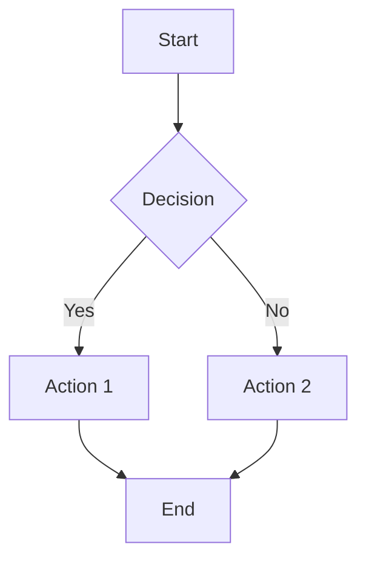

# Workflow Visualizer

## Overview
Transforms process descriptions into interactive visual maps showing connected components, decision points, and data flows. Outputs Mermaid diagrams, HTML flowcharts, or ASCII art depending on context and rendering capabilities.

## When to Use This Skill
- Documenting a business process
- Mapping a technical system architecture
- Creating onboarding documentation
- Visualizing a decision tree

## Process

### Step 1: Process Capture
From the description, extract:
- **Steps**: Sequential actions
- **Decisions**: Branch points with conditions
- **Actors**: Who or what performs each step
- **Inputs/Outputs**: Data flowing between steps
- **Loops**: Recurring or iterative processes

### Step 2: Select Output Format

**Mermaid** (best for documentation):


**HTML** (best for interactive/standalone):
- SVG-based flowchart
- Clickable nodes with detail popups
- Responsive layout

**ASCII** (best for text-only contexts):
```
[Start] → {Decision?}
              ├─ Yes → [Action 1] → [End]
              └─ No  → [Action 2] → [End]
```

### Step 3: Enhance
- Add color coding for different actor types
- Highlight critical path
- Mark failure points and error handling
- Add timing estimates if available
- Include a legend

### Step 4: Validate
- Walk through the diagram with the process description
- Verify all paths lead to a terminal state
- Check that decision points have all branches covered
- Ensure no orphaned nodes

## Key Rules
- Every diagram needs a clear start and end point
- Decision nodes must have all outcomes mapped
- Keep it to one page — if it doesn't fit, decompose into sub-processes
- Use consistent shapes: rectangles for actions, diamonds for decisions, ovals for start/end
- Label every arrow — unlabeled connections are ambiguous
